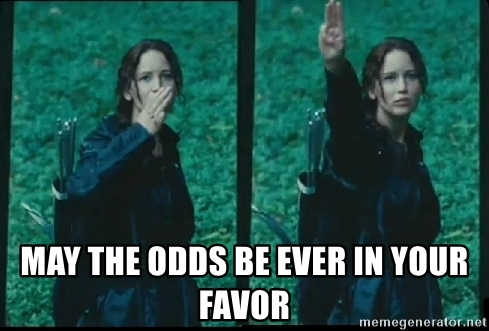
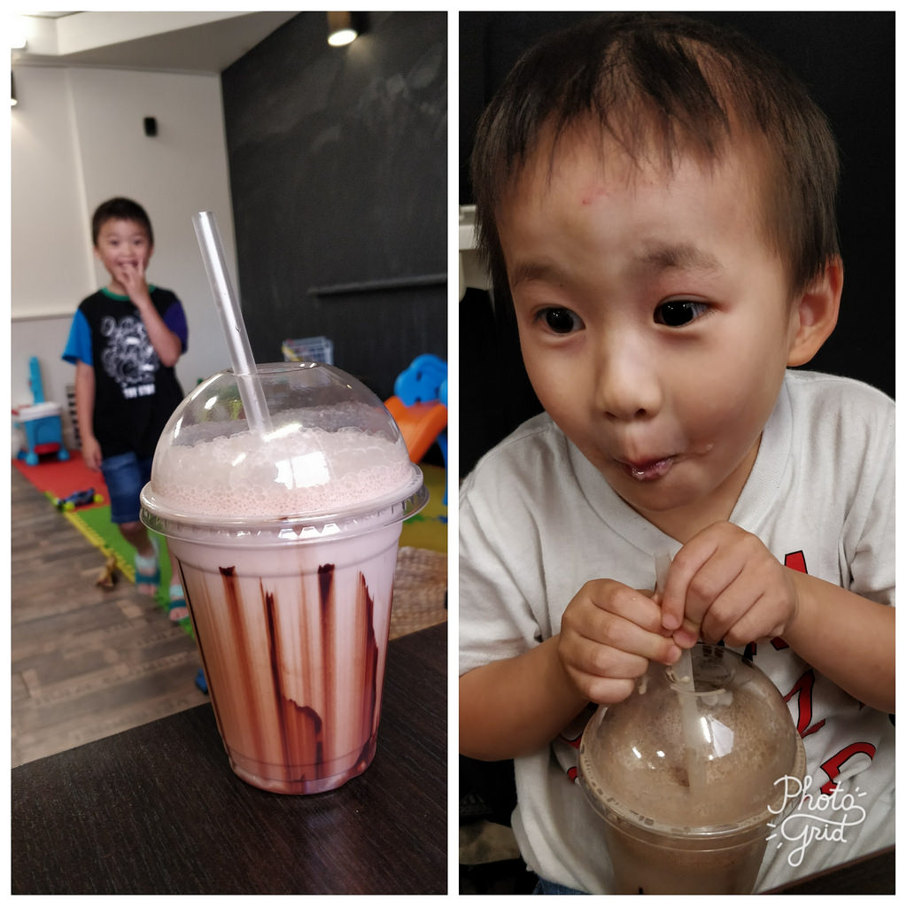
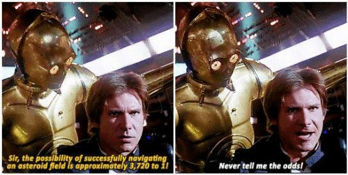

```{r}
knitr::opts_chunk$set(echo = TRUE, cache = TRUE, message = FALSE, warning = FALSE)
```

```{r}
library(tidyverse)
library(DiagrammeR)
```

We grow up learning proportions, percentages, risks, probabilities.  You encounter them when a teacher gives a grade on a test or a doctor describes the risk of an illness. On the otherhand we rarely interact with odds and when we do it's largely in contexts like:

  

So that, in our modern cultural concsciousness, 'odds' are relegated to the shady domains of gambling, sports betting, and dystopian murder games. 

The odds represent a more ancient form of understanding the relationship between potential outcomes. Yet, for most useful contexts, our society has largely forgotten them and supplanted 'odds' for 'probabilities'. See quote from Shakespeare's *Henry IV, Part II* dating back to the late 1500's:  

>Knew that we ventured on such dangerous seas  
>That if we wrought out life 'twas ten to one;

You can imagine if he were writing today the second line  might read "That if we wrought out life 'twas one out of eleven;" which doesn't have quite the same ring to it. 

Though beyond betting and playwriting, 'odds' are a generally useful method for conceptualizing event distributions. In this post, I'll describe some of the excellent qualities of odds and odds ratios. My hope is you leave this post with...

* an ability to describe the relationship between binary outcomes in terms of odds. If you're new to odds, start here [Ratios/fractions of events] before moving on to the next section..
* an understanding of how the 'odds way' of framing a problem can be convenient for comparing event outcomes across contexts.
* a simple heuristic for how to communicate in terms of 'odds' with the rest of the world.

# Different contexts

Say you're making chocolate milk and use 9 parts milk for every 1 part chocolate. Before you get the chance to have any, your little nephew comes over and tries a sip and says, "Yum, can I have that? But please, make it three times as chocolatey." The most intuitive way to please him would be to triple the amount of chocolate in the cup by adding in two more parts of chocolate so the milk to chocolate ratio in his cup is now 9:3 (simplified to 3:1). If instead you took his comment as saying he wanted the cup to be composed of $\frac{3}{10}ths$ chocolate instead of $\frac{1}{10}ths$ chocolate, your calculations to satisfy him would be slightly more complex. 

In the same way that it can be easier to think of recipes as ratios rather than fractions out of a whole, it can be easier to think of event distributions in terms of odds rather than probabilities.

 

Odds are often helpful for conceptualizing outcomes when both:

* the 'outcome of interest' is arbitrary (e.g. you don't care if the problem is framed in terms of parts *milk* or parts *chocolate*.)
* you want to compare your ratio of outcomes across different contexts (e.g. how does the distribution of *milk*:*chocolate* in *my cup* relate to the distribution in some *other cup*?)

Let's change examples to sports and substitue parts *milk*:*chocolate* for parts *winning*:*losing* when playing at home. Picture WNBA basketball. There is evidence that home court matters. Let's say the odds of the home team winning are 3 to 2, i.e. for every 3 home team wins the away team wins 2. Equivalently there is a $\frac{3}{5}ths$ chance (60% probability) of the home team winning. Maybe you want to compare this 'impact of home court advantage' across leagues to college basektball. 

Perhaps you have a friend who says "Oh, college players get rattled easily. The impact of home court advantage in college is twice what it is at the professional level."

Another friend then challenges you, "Given what you know about events at the professional level, what would be the relationship between winning and losing at home in college?"^[At first you get frustrated with your friends for not being specific as to what they mean by "twice as big an impact." Then you come to appreciate their vagueness as it gives you the latitude to try out your own definitions.] 

Taking an odds approach, you might formalize the problem your friends gave you as:

* *Already known:* odds of winning at home in the WNBA are 3 to 2.
* *New information from friend:* The ratio of home wins to losses in the WNBA to college are 2 to 1. 
* *Question she is asking:* What are the odds of winning at home in college?" 

$$2/1=\frac{??}{3/2}$$

To calculate the odds of winning at home in college you simply double the ratio of winning at home in the WNBA.

```{r}
# graph initial setting and new setting
# (3:2), * 2, then 3 to 1
```

Poof! A meaningful answer for your friend: the odds of the home team winning are 3 to 1 at the college level. 

You could have framed this problem in terms of losses and come to the same conclusion. In the WNBA, for every 2 home losses there are 3 home wins. If we invert what our friend told us, the ratio should be half that in college.

```{r}
# graph initial setting and new setting
# (3:2), * 2, then 3 to 1
```

Our odds of losing at home simplify to 1:3. This is consistent with our 3:1 odds of winning at home. It does not matter if we frame the problem as 'winning at home' or 'losing at home' the outcomes are consistent.

It's less clear how you might formalize your friend's comment as probabilities. Doubling the chance/probability of winning from $\frac{3}{5}ths$ to $\frac{6}{5}ths$ is meaningless in this context. 

```{r}
# double and see show that it increases by 2x

# :-( you can't have a probability greater than 1
```

You could flip the problem and instead frame it as 'What is the chance of *losing* at home in college.' Chance of losing at home is $\frac{2}{5}ths$, halved becomes $\frac{1}{5}th$. Therefore, the chance of winning would be 4/5ths. While you have an answer, the lack of symmetry at the start leaves you wondering if this approach produces consistent resultss.

Your friend changes things, 'On second thought, home court advantage is only a third more important in college than in the WNBA.'

For odds, replace the relevant bullet from before to instead be:

* *New information from friend:* The ratio of the odds of winning at home in the WNBA vs. in college is 4 to 3. 

```{r}
# chart showing * multiply by 4 / 3
```

This simplifies to a 2:1 odds of winning at home in college. On your own, try to invert the problem and solve for the odds of losing at home^[You should arrive at an odds of 1:2.].

For probability, we start at $\frac{3}{5}ths$ chance of WNBA home winning and increase this by a third:

```{r}
# (3/5)\*(4/3) (MAKE THIS A CHART), 
```

This simplifies to a chance of winning of $\frac{4}{5}ths$ (AKA 80%). 

If we began the problem from the perspective of losing at home, we'd start with a $\frac{2}{5}ths$ chance of losing in the WNBA, the college loss rate becomes:

```{r}
#  (2/5)\*(3/4) = 3/10,

```

This simplifies to $\frac{3}{10}ths$ (30% home loss rate) which entails a 70% home win rate.

Our college basketball home win rate came out to either 80% or 70%. Our outcome depended on if we chose 'win' or 'loss' to represent our numerator. These are just a couple examples of discontinuities you might run into when simplistically trying to compare probabilities of an event across contexts.

# Many variables

There are other factors that might affect the relationship between winning or losing at home other than college/professional level (e.g. 'quality of coach', 'distance away team traveled', etc.). Maybe you want to build a model that takes these into account. The ease with which odds can be transformed to compare variables makes them a good starting place ^[In the future I'll segue into some additional transformations you can apply to the ratios of odds that allow for more sophisticated modeling of the plausability of event outcomes across multiple variables, i.e. I'll be talking about logistic regression.]. 

# Other problems

My discussion of what we mean when we say 'twice as big an effect on home winning' has been a little loose. For a more rigorous discussion of how to try and formalize a similar comment, check-out this Stack Exchange thread: https://math.stackexchange.com/questions/761504/what-does-twice-as-likely-mean .

Odds don't always make problems more simple. For example, Bayes' function^[Maybe the most important function in statistics.] is perhaps easier to follow in it's traditional probability form:

Probability form:
$$P(A|B) = \frac{P(B|A) \cdot P(A)}{P(B)}$$

Odds form:
$$O(A_1:A_2|B) = \frac{P(B|A_1)}{P(B|A_2)}$$

-Wikipedia 

Ratios of odds are helpful for comparing impacts of variables when the target outcome falls into a class such as win/loss, red/blue, etc. Perhaps though you have a problem where an event can happen multiple times. For example, how many times will the mascot start dancing during the game? Relevant variables might be weight of custome, playing a rival/not a rival, etc. The impact of variables for this type of problem is typically best understood as the ratio of probabilities^[The classification and counting problems represent the differences between logistic and poisson regression.] - but more on this in the future^[I may or may not also discuss the differences between the logit and probit transformations and the respective advantages of each.]...

# Communicating odds

A great advantage of using probabilities is that people know how to communicate with them. If you want to try and communicate 'odds' to someone who is new to the concept, a helpful heuristic is to frame it in the template 'for every ___ ___, there are ___ ___." E.g. "For every 3 home wins, there are 2 home losses", AKA the odds of winning at home are 3 : 2.  If you need to speak about odds ratios you could tweak this form slightly, e.g. "The ratio of home wins to home losses is twice as high in college compared to professional leagues." Keeping the context of the problem central to the explanation is central to helping new learners/colleagues understand them. And the concept of odds is too important not to understand!

With a little help we can be less like Han Solo.

  

Before it's too late.


# Appendix

## Ratios/fractions of events
(THIS SECTION WAS BEFORE THE SECTION [Different contexts] BUT IT FELT UNNECESSARY.)

Imagine a bag with 5 red marbles and 2 blue marbles that has been mixed thoroughly. 

```{r, fig.height = 2}
create_graph() %>%
  add_n_nodes(5, 
              label = "I am red!!",
              node_aes = node_aes(fillcolor = "red",
                                  fontsize = 5)) %>% 
  add_n_nodes(2, 
              label = "I am blue :-(",
              node_aes = node_aes(fillcolor = "blue",
                                  fontsize = 5)) %>% 
  render_graph()

# change to show a literal bag with gganimate moving things

```

Odds could be used to represent the ratio between red and blue marbles. Probability could represent the fraction of all marbles that are either red or that are blue^[Note that while probability is limited to the domain of 0 to 1, odds can take any positive rational number.]. 

$$O(R) = \frac{R}{B}$$  
$$P(R) = \frac{R}{B+R}$$  

*Ratio for odds*^[You could say there are 5 to 2 (5:2) odds of selecting a red marble at random from the bag or, if you ran this exercise many times, you'd expect to select 2.5 times as many red marbles as blue marbles.]:

```{r, fig.height = 2, fig.width = 2}
tibble(color = c(rep("red", 5), rep("blue", 2)),
       y = c(rep(.5, 5), rep(-.5, 2)), 
       x = c(1:5, 2.5, 3.5)) %>% 
  ggplot(aes(x = x, y = y, colour = color, size = 10))+
  geom_hline(yintercept = 0, size = 3, colour = "black")+
  geom_point()+
  theme_void()+
  guides(size = "none", colour = "none")+
  scale_colour_manual(values = c(blue = "blue", red = "red"))
  
```

*Fraction for probability*^[You'd say there is a $\frac{5}{7}ths$ chance of selecting a red marble, or that you would select a red marble ~71% of the time.]:

```{r, fig.height = 2, fig.width = 2}
tibble(color = c(rep("red", 5), rep("red", 5), rep("blue", 2)),
       y = c(rep(.5, 5), rep(-.5, 7)), 
       x = c(1:5, seq(0, 6, length.out = 7))) %>% 
  ggplot(aes(x = x, y = y, colour = color, size = 10))+
  geom_hline(yintercept = 0, size = 3, colour = "black")+
  geom_point()+
  theme_void()+
  guides(size = "none", colour = "none")+
  scale_colour_manual(values = c(blue = "blue", red = "red"))
  
```

For odds (when there are only two possible outcomes^[I'll only be discussing problems with two possible outcomes.]) each outcome could be thought of as existing *either* in the numerator or in the denominator. For probabilities, the class of interest (e.g. red marbles) influences both sides.

(*Sidenote*: I like to think of odds as being more egalitarian because, in the case of a binary outcome, both possible outcomes get their own side of the ratio/fraction. Probabilities are 'outcome of interest' centric in that the selected outcome affects both sides. Hence, if you believe in things like equality and freedom you should be a fan of odds and odds ratios!)

You can switch between odds and probabilities using the function below: 

$$O = \frac{P}{1-P}$$

However, the style of thinking for odds emphasizes the relationship *between* the frequencies of possible event, whereas probabilities emphasizes the relative frequency of a *particular* event.

Some problems lend themselves more naturally to probability and others to odds. I'll briefly reference some of these differences in [Other problems]. However for the remainder of the post I'll focus on where odds suggest an intuitive and consistent framework^[Afterall odds are the ones that need PR help.].

## Note on what American betting odds are

Some of you may have hoped I'd describe what -100, +200, etc. means.